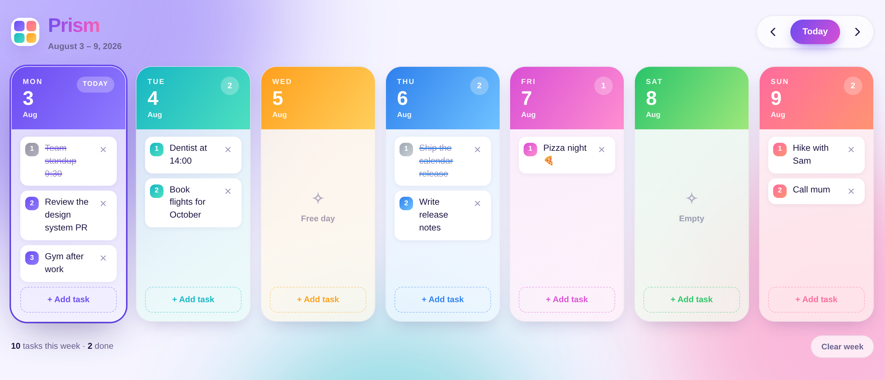
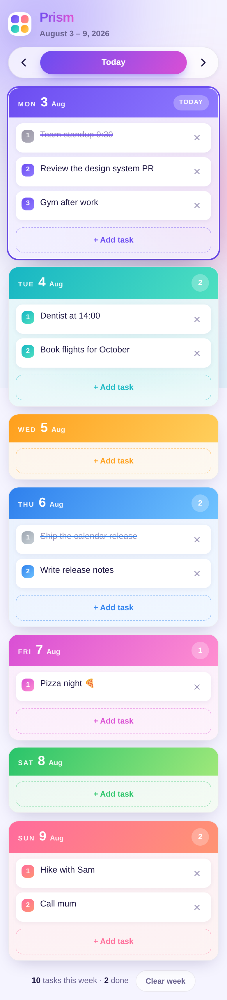

# Prism — colorful week calendar

A single-page weekly calendar. Seven day tiles, each in its own colour; click any
tile to add tasks to that day's numbered list. No dependencies, no build step,
no server required — open `index.html` and it runs.



## Features

- **Seven day tiles**, one per weekday, each with its own gradient identity.
- **Click anywhere on a tile** to open the composer and add a task to that day.
- Tasks render as a **numbered list** (`<ol>`); the numbers renumber themselves
  when items are added or removed.
- **Tap a task** to mark it done, **×** to delete it.
- Keep the composer open to add several tasks in a row — <kbd>Enter</kbd> adds,
  <kbd>Esc</kbd> closes.
- **Week navigation** with ‹ / › or the <kbd>←</kbd> / <kbd>→</kbd> arrow keys,
  and a **Today** button.
- **Clear week** wipes only the seven days currently on screen.
- Week totals and completed count in the footer.
- Everything is saved to `localStorage`, so tasks survive a reload.
- **Automatic dark mode** (follows the OS setting) and reduced-motion support.

## Responsive behaviour

| Width | Layout |
| --- | --- |
| ≥ 1181px | all seven days on one row |
| 901–1180px | 4 columns |
| 701–900px | 3 columns |
| ≤ 700px (iPhone) | single column of compact rows; the composer becomes a bottom sheet |

The phone layout uses `env(safe-area-inset-*)` so it clears the notch and home
indicator, keeps tap targets comfortable, and sets a 16px input font so iOS
doesn't zoom when the composer is focused.



## Running it

```bash
open index.html          # macOS — or just double-click the file
python3 -m http.server   # any static server works too
```

## Installing it on an iPhone

The app ships as an installable PWA: a web app manifest, app icons, and a
service worker that caches the shell so it opens with no connection.

1. **Publish it.** In this repo, go to **Settings → Pages** and set the source
   to *Deploy from a branch* → `master` → `/ (root)`. GitHub gives you a
   `https://<user>.github.io/calendar-baner/` URL a minute later. Any HTTPS
   static host works equally well — the paths are all relative.
2. **Open that URL in Safari** on the iPhone (it must be Safari; other iOS
   browsers can't install to the home screen).
3. **Share → Add to Home Screen.** You get a Prism icon that launches
   full-screen with no browser chrome, and keeps working offline.

Tasks live in that origin's `localStorage`, so the installed app and the same
URL in Safari share one list. Serving over HTTPS (or `localhost`) is required —
a service worker won't register on `file://`, and the app quietly skips
registration there rather than erroring.

## Files

| File | Purpose |
| --- | --- |
| `index.html` | markup and the composer dialog |
| `styles.css` | design tokens, tile styling, responsive rules, dark mode |
| `app.js` | state, `localStorage` persistence, rendering, events |

## Notes

- Data is stored per browser under the key `prism.calendar.v1`; there is no
  backend and nothing leaves the device.
- Task text is inserted with `textContent`, so anything typed is displayed
  literally rather than parsed as HTML.
- The week starts on Monday. Change `WEEK_STARTS_ON` in `app.js` to `0` for
  Sunday, or raise `DAYS_SHOWN` to display more than seven days.
